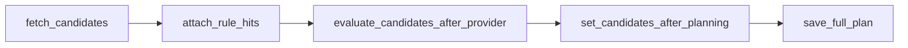

# MVP 路網候選：前置完整規格（UC-ROUTE-02）

**唯一契約載體。** 本文件定死 MVP 候選模式之模式切換、provider 契約、幾何契約、最小成功條件、道路／規則來源、最小取路與 segment 切分策略、契約測試要求，以及「放資料前」完成定義。

實作對照（程式入口）：[`RoutingProviderPort`](../app/services/ports/outbound.py)、[`route_planning_application_service.py`](../app/services/route_planning_application_service.py)、[`mvp_routing_provider_port.py`](../infra/routing/mvp_routing_provider_port.py)、[`routing_provider_factory.py`](../infra/routing/routing_provider_factory.py)、[`Settings`（ROUTING_MODE）](../../../../shared/core/config/settings.py)。

---

## §0 目標與本文件範圍

### 0.1 目標

在**不改既有最終架構**的前提下，為 UC-ROUTE-02 新增一個 MVP 候選產生模式，讓系統之後可用真實道路資料產出候選路名串，再交由既有 KML 規則檢核與持久化流程處理。

### 0.2 本規格涵蓋

- 模式切換
- provider 契約
- 幾何契約
- 最小成功條件
- 道路資料來源定案
- 最小取路策略定案
- segment 切分規則定案
- 契約測試要求

### 0.3 本規格不包含（文件層級不展開）

- 搜尋演算法優化細節
- 多候選策略優化
- UI 呈現調整
- KML 規則模型重構

### 0.4 規格 vs 程式現況

本文件「不包含真實 OSM／Overpass 抓取實作」係指：**不在此逐行規定 query／參數**；**並不表示**程式庫內不得存在最小 Overpass 呼叫。目前 [`mvp_routing_provider_port.py`](../infra/routing/mvp_routing_provider_port.py) 會經 [`OsmRoadIngestService`](../infra/road_data/osm_road_ingest_service.py) 抓取並寫入 `routing.road_source_batches`／`routing.road_edges`，再自 DB 還原圖資料組候選；**調參、bbox／搜尋半徑最佳化**仍屬 §11 排除範圍，待「放實際資料」階段演進。道路層表結構與欄位對照見 [`road_data_layer_spec.md`](road_data_layer_spec.md)。

---

## §1 架構定位

### 1.1 替換邊界

MVP **僅**替換 UC-ROUTE-02 中的**候選產生層**，即只替換：

`routing_provider.fetch_candidates(origin, destination, vehicle=…, departure_at=…)`

後續流程**全部沿用**既有實作：

- [`PostgisSpatialRuleHitPort.attach_rule_hits`](../infra/spatial/postgis_spatial_rule_hit_port.py)
- `RestrictionEvaluationService.evaluate_candidates_after_provider(...)`
- `RoutePlan.set_candidates_after_planning(...)`
- [`RoutePlanRepository.save_full_plan`](../infra/repositories/route_plan_repository.py)

### 1.2 共存模式

系統需支援兩種 mode：

- `original`
- `mvp`

### 1.3 切換方式

以系統設定切換（環境變數，見 [`Settings`](../../../../shared/core/config/settings.py)）：

- `ROUTING_MODE=original`
- `ROUTING_MODE=mvp`

**不得**新增新的 applicant／review API；**不得**新增新的 Use Case；UC-ROUTE-02 仍是唯一規劃用例。

---

## §2 Provider 規格

### 2.1 名稱

MVP provider 類別名稱：**`MvpRoutingProviderPort`**。實作既有 **`RoutingProviderPort`** 契約（[`outbound.py`](../app/services/ports/outbound.py)）。

### 2.2 方法簽名

**輸入：**

- `origin: GeoPoint`
- `destination: GeoPoint`
- `vehicle: VehicleConstraint | None`（可選；預設 `None` 視同空約束，與 `RouteRequest.vehicle_profile` 對齊時由 UC-ROUTE-02 傳入）
- `departure_at: datetime | None`（可選；用於與 `PostgisSpatialRuleHitPort` 一致之 **effective 日期**篩選適用規則；**第一版不讀** `rule_time_windows`）

**輸出（固定）：**

- `List[RouteCandidate]`

**MVP 選路前避規則（整條 way）：** 若資料庫內存在**最新已發布** map layer，則依 [`applicable_restriction_rules.py`](../infra/routing/applicable_restriction_rules.py) 載入本次適用之 `forbidden_zone`／`forbidden_road` 規則幾何，並以 PostGIS `ST_Intersects(road_edges.geom, rule_geometries.geom)` 標記須排除之 `osm_way_id`（見 [`blocked_osm_way_ids.py`](../infra/routing/blocked_osm_way_ids.py)）。組圖前自 Overpass 還原之 elements **移除**該等 way；起迄點僅吸附至**仍出現在子圖（`adj`）之節點**。子圖不連通時回傳 `[]`。

**選路後驗證不變：** [`attach_rule_hits`](../infra/spatial/postgis_spatial_rule_hit_port.py) 仍對候選路段做 ST_Intersects；正常情況下與選路前同一批 forbidden 幾何之 forbidden 命中應趨近 **0**（幾何／浮點差異除外）。

---

## §3 Candidate 輸出契約

`MvpRoutingProviderPort.fetch_candidates(...)` 回傳的每個 `RouteCandidate` 必須符合以下規格。

### 3.1 必填欄位（整體）

每個 candidate 必須具備：

| 欄位 | 說明 |
|------|------|
| `candidate_id` | `UUID` |
| `candidate_rank` | `int`，正整數，慣例自 1 遞增 |
| `route_plan_id` | `UUID` 或 placeholder（由 UC-ROUTE-02 主流程覆寫） |
| `line_geometry` | `RouteGeometry` |
| `segments` | `List[RouteSegment]`，至少 1 段 |
| `distance_m` | `int`，非負；可先為估算 |
| `duration_s` | `int`，非負；可先為估算 |
| `rule_hits` | 固定 `[]` |
| `score` | 固定 `None`（由既有評估鏈補上） |

### 3.2 欄位細則

- **`candidate_rank`**：必填；正整數；慣例自 1 遞增。
- **`route_plan_id`**：可先為 placeholder；由 UC-ROUTE-02 覆寫為當次 `RoutePlan` 的 id。
- **`line_geometry`**：必填；[`RouteGeometry`](../domain/value_objects/route_geometry.py)；`kind == LINESTRING`；至少兩點；語意上覆蓋整體路徑。不要求與所有 segment 幾何逐點完全一致，但不得語意不一致。
- **`segments`**：必填；至少 1 段。第一階段硬驗收不要求一定多段；「多段路名串」為產品目標，非此階段硬門檻。
- **`distance_m` / `duration_s`**：必填；非負整數；可先為估算；不要求導航級精度。
- **`rule_hits`**：provider 輸出時固定 `[]`。
- **`score`**：provider 輸出時固定 `None`；不屬於 MVP provider 責任。
- **`summary_text`**：可選；建議填入路名串摘要；無則可為 `None`。

---

## §4 Segment 輸出契約

每個 `RouteSegment` 必須符合以下規格。

### 4.1 必填欄位

| 欄位 | 說明 |
|------|------|
| `segment_id` | `UUID` |
| `candidate_id` | `UUID`，與父 candidate 一致 |
| `seq_no` | `int`，自 0 遞增 |
| `road_name` | `str`，**必須有值**（見 §4.2） |
| `geometry` | `RouteGeometry`（即 segment geom；DB 持久化為 `geom`） |
| `distance_m` | `int`，非負 |
| `duration_s` | `int`，非負 |
| `is_exception_road` | `bool`；MVP 一律預設 `false`，除非後續另有管線標記 |

### 4.2 `road_name`

- 型別必須為 `str`。
- **第一版唯一顯示用路名串**：與 OSM 入庫欄位 [`road_edges.road_name`](../infra/schema/road_edges.py) 及 [`road_name_from_osm_tags`](../infra/road_data/osm_road_naming.py) 語意一致——僅依序採用 `tags["name"]`（非空）→ `tags["ref"]`（非空）→ **設定值** [`Settings.osm_road_name_fallback`](../../../../shared/core/config/settings.py)（預設 **`未命名道路`**）。**不**使用 `name:zh`／`name:en`／`highway` 等作為路名後備；**不**另存獨立 `display_name` 欄位。
- 不可有空字串、`null`、或與上述規則不一致的文案混用。

### 4.3 其他

- **`geometry`**：`LINESTRING`，至少兩點；可被後續 `ST_Intersects` 使用（見 §5）。
- **`instruction_text`**：可為簡化字串或 `None`；非 MVP 第一階段硬要求。

---

## §5 Geometry／Spatial 相容規格

### 5.1 型別

`RouteCandidate.line_geometry` 與 `RouteSegment.geometry` 必須皆可轉成合法 **LINESTRING WKT**，供既有 repository 與 spatial hit 使用（[`geometry_wkt.py`](../infra/repositories/geometry_wkt.py)、[`postgis_spatial_rule_hit_port.py`](../infra/spatial/postgis_spatial_rule_hit_port.py)）。

### 5.2 座標順序

WKT 輸出需符合 **經度在前、緯度在後**（`lon lat`），與既有 `GeoPoint` → WKT 轉換語意一致。

### 5.3 最低幾何要求

每條線段：不得為單點；不得為空 geometry；不得退化成無效線。

### 5.4 與規則檢核相容

- [`PostgisSpatialRuleHitPort`](../infra/spatial/postgis_spatial_rule_hit_port.py) 可對 **segment 幾何**逐段做 `ST_Intersects`。
- candidate 與 segment geometry 能被後續命中邏輯使用。
- 不要求 candidate 整線與 segment 幾何逐點完全相同，但需語意一致。

**領域欄位名**：segment 幾何在領域為 **`geometry`**；資料庫欄位為 **`geom`**（見 [`route_plan_repository.py`](../infra/repositories/route_plan_repository.py)）。

---

## §6 MVP 道路與規則資料來源定案

### 6.1 道路資料來源

MVP mode 之道路來源固定為：**OSM／Overpass**。

### 6.2 規則來源

規則來源固定為：**既有 KML／KMZ 匯入後之 restriction 相關表**，例如（實際以 schema 為準）：

- `map_layers`
- `restriction_rules`
- `rule_geometries`
- `rule_time_windows`

規則檢核由既有 [`PostgisSpatialRuleHitPort`](../infra/spatial/postgis_spatial_rule_hit_port.py) 與評分鏈處理；**MVP provider 不讀規則表**。

### 6.3 不新增之規則來源（第一階段）

不得新增：Google／HERE 避讓規則、額外人工規則表、額外自訂交通規則資料等。

---

## §7 MVP 最小取路策略規格

此處為**第一版允許的簡化策略**，非最終最佳化。

### 7.1 搜尋目標

輸入起點、終點後，從道路資料中組出一條**最小可串接道路鏈**，作為 candidate。

### 7.2 第一版可接受策略（概念）

- 以起點、終點建立搜尋範圍；
- 從該範圍抓取道路段；
- 找起點／終點附近可接道路；
- 在抓到的道路集合中組出可串接鏈；
- 轉成 candidate 與 segments。

### 7.3 MVP 明確不處理

單向／雙向限制、真實可駕駛性、轉彎限制、車道邏輯、導航級最佳路徑、交通流量、真實 ETA 精度等。

### 7.4 MVP 成功定義（策略層）

能組出候選道路鏈、能切成 segment、能接後續 KML 規則檢核、最後能回「路名串」或 `no_route`（由 UC-ROUTE-02 整體判定）。

---

## §8 Segment 切分規則

### 8.1 切分原則

MVP 以「**道路段**」（例如 OSM way 語意）為基本切分單位。

### 8.2 切分輸出

每個切分單位對應一個 `RouteSegment`：`seq_no` 遞增、`road_name` 必有值、`geometry` 合法、`distance_m`／`duration_s` 有值。

### 8.3 路名

若連續道路段名稱一致，**後續優化**可考慮合併；MVP 第一階段不要求高級合併，只要求輸出一致、可讀。

### 8.4 Fallback

若無名道路出現：必須統一使用 §4.2 之 **`name` → `ref` → `osm_road_name_fallback`** 規則；不可混用空字串、`null` 或任意文案。

---

## §9 最小成功條件

### 9.1 硬驗收（契約打通）

以下**全部**成立，才算 MVP provider 契約打通：

1. `fetch_candidates(...)` 至少回 **1** 個 `RouteCandidate`。
2. 每個 candidate 至少有 **1** 個 `RouteSegment`。
3. 每個 segment 的 `road_name` **必有值**（含 fallback）。
4. 每個 segment 的 `geometry` 為合法 **LINESTRING**。
5. provider 輸出時 `rule_hits == []`。
6. provider 輸出時 `score is None`。
7. 經**完整 UC-ROUTE-02** 後 `score` 已補齊，且最終可成功進入 `save_full_plan(...)`（整鏈驗證；非單元測試必備項）。

### 9.2 產品目標（非硬驗收）

多段路名串、更自然的路名合併、多候選、更好摘要、更合理 distance／duration 等——不作為第一階段阻擋條件。

---

## §10 契約測試要求

### 10.1 文件

本檔 [`mvp_routing_provider_contract.md`](mvp_routing_provider_contract.md) 為**唯一**契約載體。

### 10.2 程式註記

[`mvp_routing_provider_port.py`](../infra/routing/mvp_routing_provider_port.py) 模組 docstring 應指向本文件；完整章節為 §0–§12。

### 10.3 最低測試（建議覆蓋）

輕量契約測試應至少驗證：

- candidate 數量、segment 數量（符合 §9.1）；
- `road_name` 非空（含 fallback 規則）；
- `geometry` 為合法 `LINESTRING`；
- 可被既有 WKT／spatial 輔助函式接受；
- provider 輸出語意下 `score is None`、`rule_hits == []`。

參考：[`test_mvp_provider_output_contract.py`](../../../../shared/tests/unit/contexts/routing_restriction/test_mvp_provider_output_contract.py)、[`test_mvp_routing_provider_port.py`](../../../../shared/tests/unit/contexts/routing_restriction/test_mvp_routing_provider_port.py)（mock 入庫／讀取與 HTTP，不呼叫真實 Overpass）、[`test_road_data_unit.py`](../../../../shared/tests/unit/contexts/routing_restriction/test_road_data_unit.py)（路名／簽章／解析）。

### 10.4 測試範圍限制

此階段：**不要求真實 Overpass**、不要求真實 OSM 抓取、不要求搜尋品質；只驗**契約**與鏈打通之意涵。

---

## §11 此階段明確不做的事

以下排除在「放資料前」規格演進之外（可於後續迭代再做）：

- 真實 Overpass query 調參、bbox／corridor／search radius 最佳化；
- 多候選排序、候選重試、高品質多段切分、路名合併優化、多路徑比較；
- 真實導航合法性、UI 顯示優化。

---

## §12 放資料前的完成定義

以下**全部**完成，才算可進入「放實際道路／規則資料」之迭代：

1. `ROUTING_MODE` 切換已存在。
2. `MvpRoutingProviderPort` 類別已存在。
3. Provider 契約文件已定稿（本文件 §0–§12）。
4. Candidate／Segment 輸出契約已定稿（§3–§4）。
5. Geometry 相容規格已定稿（§5）。
6. 道路資料來源已定為 OSM／Overpass（§6.1）。
7. 規則來源已定為既有 KML restriction 表（§6.2）。
8. 最小取路策略已定稿（§7）。
9. Segment 切分規則已定稿（§8）。
10. 最小契約測試已存在（§10）。

---

## 附錄：與現行程式快速對照

| 主題 | 位置 |
|------|------|
| `ROUTING_MODE` | [`settings.py`](../../../../shared/core/config/settings.py) |
| Provider 工廠 | [`routing_provider_factory.py`](../infra/routing/routing_provider_factory.py) |
| Facade 注入 | [`routing_application_service.py`](../app/services/routing_application_service.py) |
| UC-ROUTE-02 管線 | [`route_planning_application_service.py`](../app/services/route_planning_application_service.py) |
| 道路資料層（OSM／批次／edges） | [`road_data_layer_spec.md`](road_data_layer_spec.md)、[`infra/road_data/`](../infra/road_data/) |
