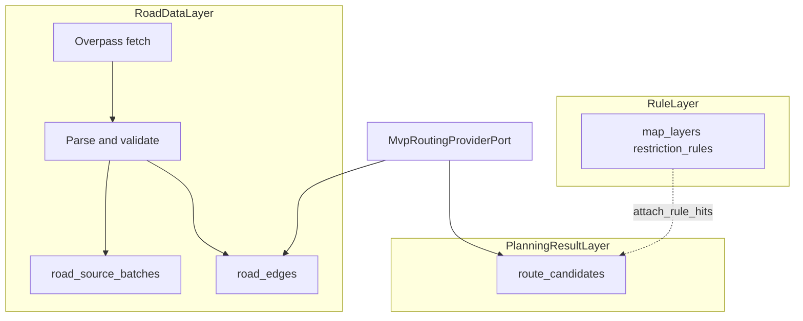

# 道路資料層（OSM / Overpass）規格

與實作對照：`routing.road_source_batches`、`routing.road_edges`（[`infra/schema/`](../infra/schema/)）；抓取與解析 [`OsmRoadIngestService`](../infra/road_data/osm_road_ingest_service.py)；bbox／簽章 [`bbox_and_signature.py`](../infra/road_data/bbox_and_signature.py)；路名 [`osm_road_naming.py`](../infra/road_data/osm_road_naming.py)；MVP 候選組裝 [`mvp_routing_provider_port.py`](../infra/routing/mvp_routing_provider_port.py)。候選輸出契約仍見 [`mvp_routing_provider_contract.md`](mvp_routing_provider_contract.md)。

---

## §1 目標與範圍

- **目標**：自 Overpass 取得區域內 `highway` ways，解析後持久化至 `routing` schema，供 `MvpRoutingProviderPort` 建圖與產出 `RouteCandidate`，**不**寫入 `route_plans`／`route_rule_hits`，**不**改規則表。
- **本階段不做**：多候選優化、單雙向、排程同步、UI、規則命中變更、跨 batch 去重與增量同步。

---

## §2 架構位置

---

## §3 資料表與欄位對照

### §3.1 `routing.road_source_batches`

| 欄位 | 說明 |
|------|------|
| `batch_id` | PK |
| `source_type` | 固定 `osm_overpass` |
| `query_signature` | SHA-256 hex（截断至 varchar 容量），見 §5 |
| `bbox_geom` | Polygon, SRID 4326 |
| `origin_point` / `destination_point` | Point 可 null |
| `query_text` | 完整 Overpass 查詢字串 |
| `source_generated_at` | 可選 |
| `fetched_at` | 取得時間 |
| `status` | 流程狀態（如 fetched → parsed / failed） |
| `record_count` | **成功寫入** `road_edges` 筆數 |
| `parse_skipped_count` | `int not null default 0`：略過之 way 數（無 geometry、點數不足、缺 `highway` 等） |
| `error_message` | 失敗時訊息 |
| `created_at` / `updated_at` | 時間戳 |

### §3.2 `routing.road_edges`

| 欄位 | 說明 |
|------|------|
| FK `batch_id` | → `road_source_batches` |
| `osm_element_type` | 如 `way` |
| `osm_way_id` | OSM id |
| `segment_index` | 同 way 多段時遞增（第一版通常 0） |
| `road_name` | **唯一**顯示用路名串，見 §6；**禁止空字串** |
| `road_ref` | `ref` tag，可 null |
| `highway_type` | `highway` tag |
| `geom` | LineString 4326 |
| `bbox_geom` | 可 null |
| `node_count` | 幾何點數 |
| `length_m` | 近似長度 |
| `raw_tags_json` | 完整 tags |
| `raw_payload_fragment` | 最小原始片段（如 `nodes`），供除錯／免重抓 |
| `is_active` | 啟用旗標 |
| `fetched_at`、時間戳 | |

**索引**：`(batch_id)`、`(osm_way_id)`、`(highway_type)`；`geom`／`bbox_geom` 使用 GiST（若存在）。

**同 batch 防重**：`UniqueConstraint(batch_id, osm_way_id, segment_index)`。

---

## §4 Overpass 查詢

- 形態：`way["highway"](south,west,north,east)`；輸出需含 **id、tags、geometry**（例如 `out body geom`）。
- 查詢全文存入 `road_source_batches.query_text`。

實作：[`overpass_query.py`](../infra/road_data/overpass_query.py)。

---

## §5 Bbox 與 `query_signature`

- **Bbox**：以起訖點為基礎，依 [`Settings.road_fetch_bbox_pad_deg`](../../../../shared/core/config/settings.py) 向外擴張，產出四角與 Polygon WKT（與既有 MVP bbox 概念一致）。
- **`query_signature`**：對 `origin`、`destination`、正規化 bbox 四至、[`Settings.overpass_query_version`](../../../../shared/core/config/settings.py) 做穩定 JSON 序列化後 **SHA-256 hex**（實作截断至 64 字元 hex）。

---

## §6 `road_name` 規則（第一版）

- `road_edges` **僅** `road_name`，**不**另存 `display_name`。
- 解析**只允許**下列單一路徑（不採 `name:zh`／`name:en`）：
  1. `tags["name"]` 為非空字串 → 存該字串（trim）。
  2. 否則 `tags["ref"]` 為非空字串 → 存該字串（trim）。
  3. 否則 → [`Settings.osm_road_name_fallback`](../../../../shared/core/config/settings.py)（預設 **`未命名道路`**）。

語意上與 `RouteSegment.road_name` 一致；查詢／測試不應出現 `""`。

---

## §7 解析與持久化

1. 遍歷 Overpass `elements` 中 `type=way`；略過無 `highway`、無效 geometry（點數 &lt; 2）、無法組 LineString、`nodes` 與 geometry 點數不一致等——每略過一筆 **`parse_skipped_count += 1`**。
2. **`record_count`** = 成功插入 `road_edges` 筆數。
3. 交易：插入 batch（狀態隨流程更新）；失敗則 `failed` + `error_message`。
4. **無跨請求去重、無增量**：每次請求新建 batch 並插入 edges；跨 batch 允許相同 `osm_way_id`。

---

## §8 與 `MvpRoutingProviderPort` 銜接

- `fetch_candidates`：**抓取並持久化** → 以 `batch_id` **載入**本批 edges（或還原為與 Overpass 等價之 way elements）→（可選）依最新已發布 layer 之適用 **forbidden_zone／forbidden_road** 與 `road_edges.geom` 做 PostGIS 相交，**整條 `osm_way_id` 自 elements 移除**後再組子圖 → **共用**圖構建／最短路邏輯產出候選。
- 規則命中驗證仍由下游 `attach_rule_hits` 負責；道路層此處僅做「選路前子圖排除」以降低最短路穿禁區。
- 若 Overpass／持久化失敗：回傳 `[]`（與既有行為一致），並將 batch 標為失敗。

---

## §9 設定

| 設定 | 用途 |
|------|------|
| `road_fetch_bbox_pad_deg` | Bbox 外扩 |
| `overpass_query_version` | 簽章版本 |
| `osm_road_name_fallback` | 無 name/ref 時路名 fallback |
| **`ROUTING_MODE=mvp`** | 啟用 [`MvpRoutingProviderPort`](../infra/routing/mvp_routing_provider_port.py)（見 [`Settings`](../../../../shared/core/config/settings.py)）；預設 `original` 為 Stub，不寫入 `road_*`。 |

### 端到端規劃鏈（與本層銜接）

- **前置**：PostgreSQL **已安裝 PostGIS**（`init_db` 會 `CREATE EXTENSION postgis`）；否則 `routing.*` 含 `road_edges` 不會建立。
- **開關**：環境變數 **`ROUTING_MODE=mvp`**，應用重載設定後 [`build_routing_provider_from_settings`](../infra/routing/routing_provider_factory.py) 才會使用 Overpass→入庫→組候選。
- **觸發 UC-ROUTE-02**（起訖已地理編碼、`route_request` 為 `planning_queued`）：
  - 程式：[`RoutingApplicationService.run_auto_planning`](../app/services/routing_application_service.py)（內部 [`run_auto_planning_for_application`](../app/services/route_planning_application_service.py)）；
  - HTTP：審查端 **`POST …/route-plan/replan`**（[`review_replan`](../app/services/route_plan_review_application_service.py)），與申請人僅 `POST …/route-request`（不自動規劃）之分流見 [`mvp_routing_provider_contract.md`](mvp_routing_provider_contract.md)。
- **管線**：`fetch_candidates` → `attach_rule_hits` → `evaluate_candidates_after_provider` → `set_candidates_after_planning` → `save_full_plan`（與道路層契約無關之段落不重複）。

---

## §10 測試策略

- **單元**：路名規則、`query_signature` 穩定性、way 解析與略過計數（fixture JSON）。
- **契約測試**：不強制真 Overpass；可 mock HTTP 與入庫／讀取。
- **整合**：可選 PostgreSQL + PostGIS；[`test_mvp_routing_e2e_integration.py`](../../../../shared/tests/integration/contexts/routing_restriction/test_mvp_routing_e2e_integration.py) 以 mock Overpass 跑通 **create_route_request → run_auto_planning** 並斷言 `routing.road_*` 與單候選路段。

---

## §11–§13 參考

- §11：規則層仍由 `PostgisSpatialRuleHitPort` 等既有元件負責，道路層不寫規則命中。
- §12：文件與程式欄位對照以上表為準。
- §13：刻意不實作項目見 §1「本階段不做」。
